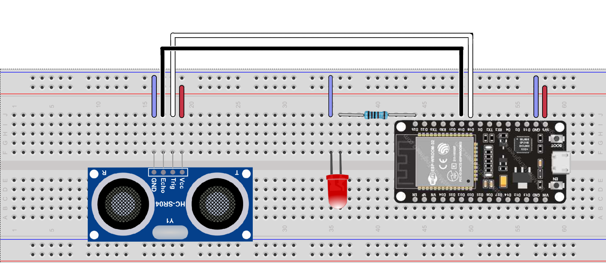
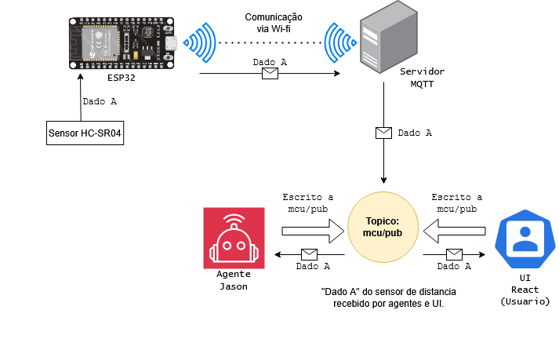
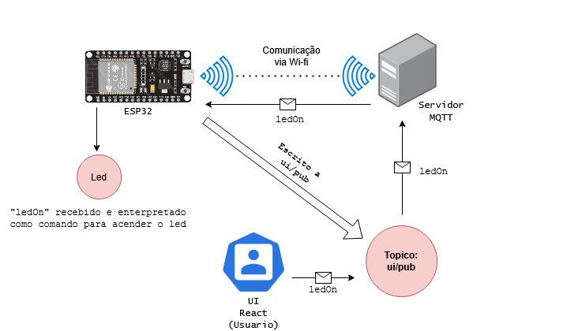

# DEC0021 - Trabalho comunicação entre ESP32, React e Agentes Jason via MQTT

## Introdução
Este projeto foi desenvolvido para a materia de Projeto de Sistemas Ubiquos e Embarcados na UFSC. O trabalho possui o intuito de permitir a comunicação simples entre sistemas compostos de microcontroladores, agentes inteligentes e frontends ou UIs para um usuario. Em sistemas distribuidos, este tipo de comunicação é desenvolvida com dois pontos especificos como foco(Por exemplo, uma interface escrita em Javascript que se comunica com um agente escrito em Jason), ou "point-to-point", o que leva estas implementações a serem fortemente acopladas aos pontos escolhidos, uma dependencia das estruturas e frameworks utilizadas pelos pontos escolhidos, de tal forma que torna dificil a adição de novos pontos ou substituição de tecnologias. Com este problema em mente, o projeto visa utilizar MQTT como meio para troca de mensagens, onde estas utilizam um modelo padrão que todos os pontos entendem.

Para isto, são utilizados microcontroladores ESP32 programados com base no sistema operacional Zephyr, uma interface de usuario programada  React, Agentes Jason configurados através de JaCaMo, Servidor programado em Node e utilizando o broker de mensagens Eclipse Mosquitto.

## Tabela de Conteudos

- [Hardware Utilizado](#hardware-utilizado)
- [Instalação](#instalação)
- [Configuração do Hardware](#configuração-do-hardware)
- [Exemplo de Funcionamento](#exemplo-de-funcionamento)
- [Diagnostico de Problemas e Soluções](#diagnostico-de-problemas-e-soluções)

---
## Hardware Utilizado
#### - Esp32
O microcontrolador escolhido para o projeto. O chip desta placa em especifico é o ESP32-D0WD-V3, com funcionalidade Wi-Fi e Dual Core + LP Core. 

#### - Sensor HC-SR04
Utilizado para gerar uma medida de distancia que é transmitida periodicamente.

#### - Led
Utilizado como mecanismo de verificação de comunicação entre o frontend e o microcontrolador.

### Esquema de Conexões


---
## Instalação
As instalações mencionadas nesse topico são realizada para o Windows 10.
- [Jacamo](Tutorials/Jacamo.md)
- [Eclipse Mosquitto](Tutorials/MQTT.md)
- [Zephyr](Tutorials/Zephyr.md)

---
## Configuração do Hardware
As configurações de pinos estão definidas em `./boards/esp32_devkitc_procpu.overlay` na pasta de projeto do zephyr, definidas como:

| Pino | Alias | Funcionalidade|
|------|------|--------|
| `GPIO23` | led0 | Acionamento do led. |
| `GPIO18` | distance0 | Pino de Trigger do sensor HC-SR04. |
| `GPIO19` | distance0 | Pino de Echo do sensor HC-SR04. |

> Zephyr utiliza um conceito de "Alias" ou "Node" para definir o acesso aos pinos de hardware. Os pinos são associados a uma "Alias", e então podem ser referenciados no codigo. Para os pinos de Trigger e Echo do HC-SR04, é utilizado uma mesma Alias, sendo que o seu acesso e feito atraves de uma função interna do Zephyr.

---
## Exemplo de Funcionamento
O sistema é baseado em MQTT, logo, os integrantes do sistema, ESP32, Agentes e a Interface se comunicam publicando informações para topicos especificos, e todos os integrantes que estiverem subscritos nestes topicos recebem estas informações. Cada integrante neste projeto possui um topico `/pub` pro qual publicam: `ui/pub`,`agent/pub` e `mcu/pub`. Um integrante está subscrito nos topicos `/pub` dos outros dois integrantes. Isto, em pratica, permite que cada integrante veja todas as mensagens dos outros integrantes.
Os dados transmitidos no sistema são emitidos em um formato JSON padrão que todos os integrantes utilizam:
```
{id: ..., sender: ..., text: ....}
```
cada integrante deve tratar dados recebidos por este formato para poder utiliza-lo.
Exemplos de comunicação:
1. Envio de dados de sensores do ESP32 aos Agentes e Interfaces
o Esp está programado para periodicamente enviar a leitura do sensor de distancia:



2. Envio do comando "ledOn" para o ESP32
A interface(ou agentes) podem publicar a mensagem "ledOn". O ESP32 ve esta mensagem e interpreta como o comando de ligar o led. Da mesma maneira, interpreta "ledOff" como o comando de desligar o led.



## Diagnostico de Problemas e Soluções
- Conexão ao broker MQTT
Inicialmente, o ESP32 não conseguia se conectar ou broker MQTT que estava em exeução na maquina principal. Foi verificado que qualquer outra maquina conseguia se conectar, e o problema se tratava de uma configuração na maioria dos roteadores que bloqueia qualquer aparelho não identificado de se conectar por LAN a outro aparelho. Para resolver este problema, foi utilizado o hotspot do celular como rede, que não possui essa configuração de bloqueio de acesso a LAN. Outra solução seria definir um IP fixo ao esp32, mas isso não erá uma solução viavel para este projeto.
- Leitura de mensagens JSON no Zephyr
O formato padrão decidido para o sistema foi de um JSON. Zephyr possui metodos para extrair dados de um formato JSON especificado, mas não foi obtido sucesso em utiliza-lo. Logo, foi desenvolvido a função `get_text_field`, que procura a substring de `\"text\":` dentro da mensagem em JSON, e extrai o texto entre aspas duplas, guardando este em um buffer que é então usado pelo sistema.
